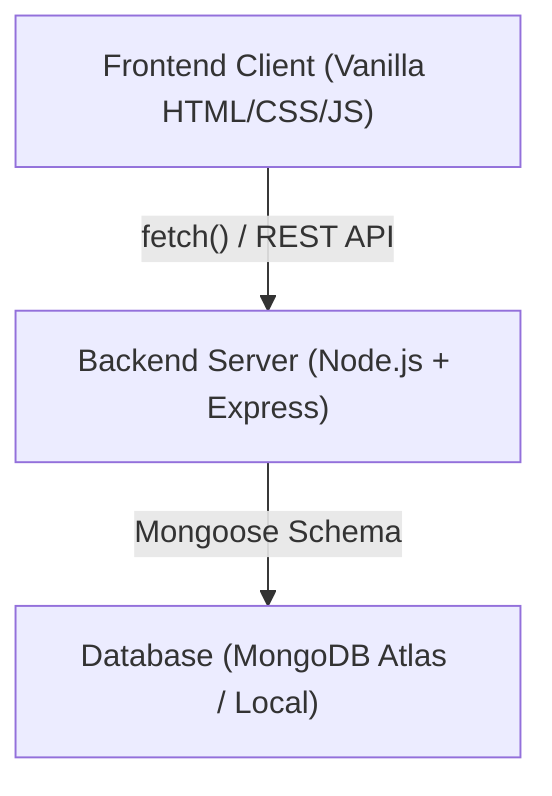

# 💧 AquaSmart — Smart Water Conservation Platform

A full-stack web application designed to help individuals, households, and communities track, optimize, and conserve water. AquaSmart features role-based access control, interactive data visualization, real-time goal tracking, and expert-curated water-saving strategies.

---

## ✨ Key Features & Modules

### 1. User Dashboard & Analytics Layer
- **Interactive Charts**: Visualizes water usage over the last 7 days (Bar/Line charts via Chart.js).
- **Device Breakdown**: Doughnut chart showing consumption split across connected appliances.
- **Goal Tracking**: Animated SVG progress rings showing monthly consumption vs set allowance limit.

### 2. Device Management
- Register and categorize distinct water-consuming devices (Shower, Tap, Irrigation, Washing Machine, Toilet, Dishwasher).
- Track specific daily average consumption benchmarks.

### 3. Smart Usage Logging
- Event-based usage logging with dynamic calculation mapping amounts (in Litres), duration, and contextual notes.

### 4. Expert Tips System
- Browse categorized, location-aware water conservation strategies.
- **Provider Portal**: Verified service experts can submit new tips dynamically.

### 5. Administrative Control Panel
- Platform-wide statistics overview (total users, devices, water logged).
- Role management & Provider verification (approve/revoke expert credentials to publish tips).
- **Tip Moderation**: Review pending tips from providers and forcefully manage/delete any published tips.

---

## 🛠 Technology Stack

### Backend
- **Runtime**: Node.js (v18+)
- **Framework**: Express.js
- **Database**: MongoDB & Mongoose (ODM)
- **Security & Env**: JWT (Stateless access tokens mapped to LocalStorage), `bcryptjs` (password hashing), `dotenv`, `cors`.

### Frontend
- **Languages**: Vanilla HTML5, CSS3, JavaScript (ES6+). No heavy frameworks used, optimizing bundle weight.
- **System Design**: Modular UI (api helpers, auth guards, page-specific JS controllers).
- **Aesthetics**: Custom dark-mode CSS variables array, responsive sidebar grids, animated notifications.
- **Libraries**: Chart.js (via CDN), Font Awesome (v6).

---

## 🔄 System Architecture

> The frontend communicates asynchronously with the backend RESTful API. JSON Web Tokens (JWT) are securely handled in headers to validate roles before any core CRUD operations take place.



---

## 🚀 Quick Start & Installation

### Prerequisites
- Node.js installed locally.
- MongoDB running locally (port 27017) or a MongoDB Atlas connection URI.

### Step 1: Backend Setup
Open a terminal and navigate to the backend directory:
```bash
cd backend
npm install
```

Ensure a `.env` file exists in the `backend/` folder with the following:
```env
PORT=5000
MONGO_URI=mongodb://localhost:27017/smart_water_platform
JWT_SECRET=super_secret_dev_key
JWT_EXPIRE=30d
```

Start the development server:
```bash
npm run dev
```
*(Backend API is now live at `http://localhost:5000`)*

### Step 2: Frontend Setup
Because the frontend uses vanilla HTML/CSS/JS, there is **no build step required**.

**Option A (Simply Open):**
Double-click `frontend/index.html` to open it in your browser natively.

**Option B (Local Server - Recommended):**
```bash
npx serve frontend
```
*(Access the app at `http://localhost:3000`)*

---

## 🔐 Access Roles & Test Strategy

| Role | Access Permissions | UI Views |
|------|--------------------|----------|
| **User** (Default) | Manage devices, log usage, set target goals, view public tips | Dashboard, Devices, Logs, Goals, Tips |
| **Provider** | Submit new water-saving strategies. Requires Admin approval to publish. | Provider Portal, Tips |
| **Admin** | View platform stats, approve provider accounts, manage users, delete/publish tips. | Admin Panel, Tips |

### How to test the Admin Panel
1. Register a new account via the UI (`admin@test.com`).
2. By default, the account is a `user`. 
3. Open MongoDB Compass (or Mongo Shell) and manually grant admin privileges:
```javascript
db.users.updateOne({ email: "admin@test.com" }, { $set: { role: "admin" } })
```
4. Log back in to access the Admin Panel. From there, you can easily promote other users to Admin via the UI without touching the database again.

---

## 📂 Project Structure

```text
smart-water-platform/
├── backend/
│   ├── config/db.js          # DB Connection Logic
│   ├── controllers/          # Business logic handlers
│   ├── middleware/           # auth.js (JWT validation & role guards)
│   ├── models/               # Mongoose DB Schemas (User, Device, Tip, Goal, UsageLog)
│   ├── routes/               # Express API routing mappings
│   ├── .env                  # Environment Variables
│   └── server.js             # Initializer & Port binding
└── frontend/
    ├── css/style.css         # Complete UI Design System
    ├── js/
    │   ├── admin.js          # Admin tools & tab switching logic
    │   ├── api.js            # Standardized fetch wrappers & payload processing
    │   ├── auth.js           # Shared token session guards & UI mutators
    │   ├── dashboard.js      # Main chart rendering and aggregation mapping
    │   ├── devices.js        # CRUD for appliance inventory
    │   ├── goals.js          # SVG Progress visualization & targets
    │   ├── tips.js           # Search/Filtering logic & provider submission
    │   └── usage.js          # Datetime logging and history grids
    └── *.html                # Independent views mapped to controllers
```

---

